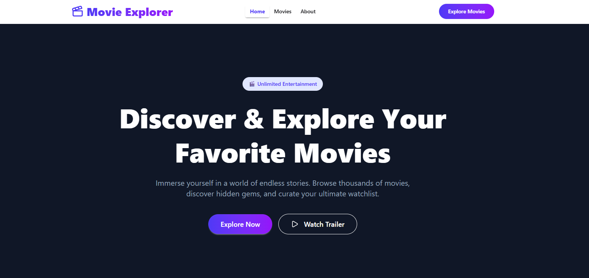
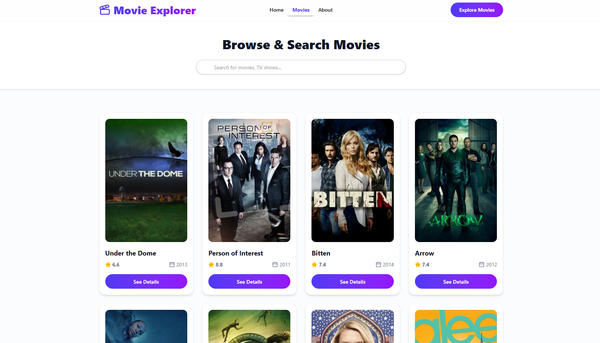
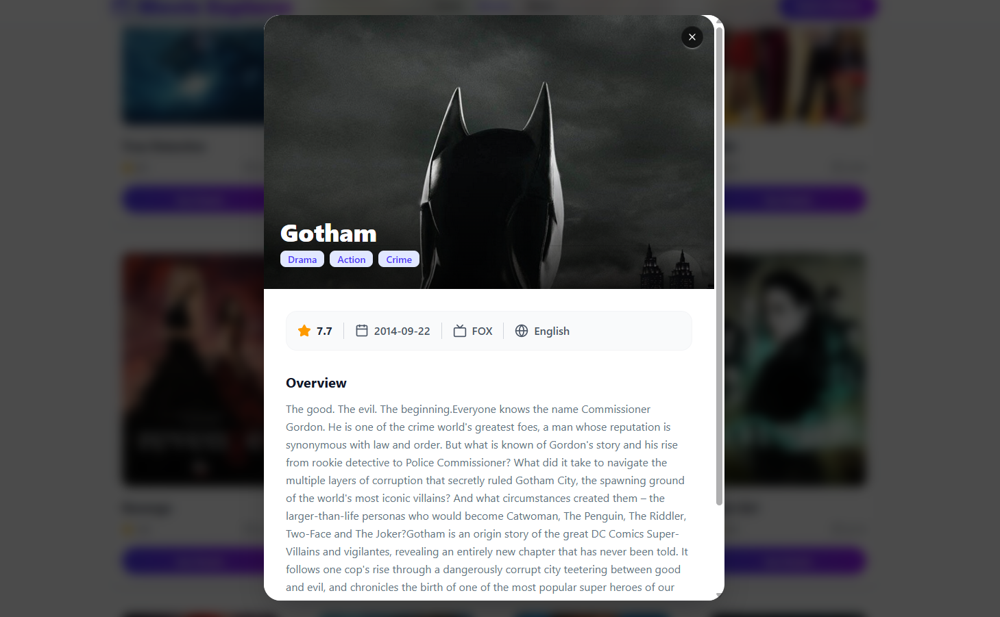

# 🎬 Movie Explorer

> A modern, responsive web application built with React 19 and Tailwind CSS that enables movie and TV show enthusiasts to seamlessly search, browse, and inspect detailed metadata in real time.

[](https://movieexpl0er.netlify.app)
[](https://github.com/nahin113/movie-explorer-)

---

## 📌 Problem & Solution

### The Problem
Finding quick, reliable information about TV shows and movies often involves navigating cluttered, ad-heavy websites with poor mobile responsiveness and slow loading speeds.

### The Solution
**Movie Explorer** delivers a lightweight, lightning-fast browsing experience. By connecting directly to the open **TVMaze API**, it provides instant title searches, rich show details, rating overviews, and clean UI overlays—all optimized for mobile, tablet, and desktop screens.

---

## 📸 Application Screenshots

| Home Page Hero | Movie Search & Grid | Details Modal |
| :---: | :---: | :---: |
|  |  |  |

---

## ✨ Key Features

- 🔍 **Real-Time Search & Debouncing:** Search TV shows and movies dynamically by title without refreshing the page.
- 📱 **Fully Responsive Layout:** Optimized grid system adjusting from 1 column on mobile to 4 columns on large desktop screens (`w-11/12 lg:w-8/12 mx-auto`).
- 🍿 **Interactive Details Modal:** Inspect plot overviews, ratings, premiered dates, networks, and genre badges in an accessible pop-up overlay.
- ⚡ **Zero-Latency API Integration:** Fetches live show data from TVMaze with graceful error handling and custom loading spinners.
- 🎨 **Modern Cinema Aesthetic:** Styled with custom linear gradients, DaisyUI v5 components, and smooth micro-interactions.

---

## 🛠️ Tech Stack & Dependencies

- **Frontend Core:** React 19, JavaScript (ES6+)
- **Build Tooling:** Vite
- **Styling Framework:** Tailwind CSS v4, DaisyUI v5
- **Routing:** React Router v7 (`react-router-dom`)
- **Icons:** Lucide React (`lucide-react`)
- **Data Source:** External TVMaze API
- **Deployment Platform:** Netlify

---

## 🌐 API Integrations

Movie Explorer integrates with the free, public **TVMaze REST API**:

| Purpose | Method | Endpoint |
| :--- | :---: | :--- |
| Fetch All Shows | `GET` | `https://api.tvmaze.com/shows` |
| Search Shows by Query | `GET` | `https://api.tvmaze.com/search/shows?q=:query` |

---

## 🚀 Getting Started Locally

Follow these steps to run the project on your local machine:

### Prerequisites
- [Node.js](https://nodejs.org/) (v18.x or higher)
- `npm` or `yarn`

### Installation Steps

1. **Clone the repository:**
   ```bash
   git clone [https://github.com/nahin113/movie-explorer-.git](https://github.com/nahin113/movie-explorer-.git)
   cd movie-explorer-
